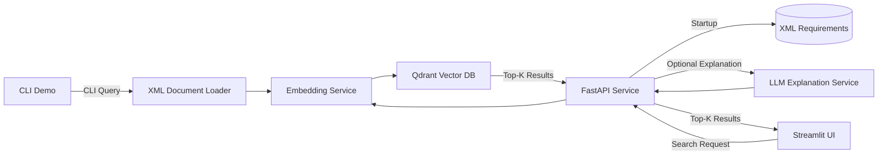

# AI Requirements Engine

An AI system for semantic requirement retrieval using embedding-based similarity search and a persistent vector database, designed as a core component of a Retrieval-Augmented Generation (RAG) pipeline.
The system indexes structured XML requirements, stores embeddings in a Qdrant vector database, and exposes semantic search via a REST API, a CLI demo, and a Streamlit web interface.

Author: Patrick Nanz

## Live API Demo

Public API deployment (AWS EC2 + Docker):

Swagger UI:  
http://51.20.45.195:8000/docs

Example request:

POST /analyze

```json
{
  "query": "The system shall support multi-factor authentication",
  "top_k": 3
}
```

## Contents

- [Quickstart](#quickstart)
- [Project Goal](#1-project-goal)
- [Architecture Overview](#2-architecture-overview)
- [Tech Stack](#3-tech-stack)
- [How to Run](#4-how-to-run)
- [API Layer](#5-api-layer)
- [Core Components](#6-core-components)
- [Testing](#7-testing)
- [User Interface](#8-user-interface)
- [Project Structure](#9-project-structure)


## Quickstart

Clone the repository and install dependencies:

```bash 
pip install -e .
```

This project requires an OpenAI API key for the LLM explanation feature.
Set the environment variable before running the application:

```bash
export OPENAI_API_KEY=<your_api_key>
```

Start the system (API + Qdrant):

```bash
docker compose up --build
```

Run the interactive demo:

```bash
python demo.py
```

Run the web interface:

```bash
streamlit run src/ui/app.py
```


## 1. Project Goal

This project implements the core retrieval component of a Retrieval-Augmented Generation (RAG) architecture.  
It enables semantic comparison of customer requirements to identify previously implemented similar requirements.


## 2. Architecture Overview

Requirements are stored as individual XML files (simulating ALM/PLM systems such as Polarion or DOORS), containing structured metadata (title, status, owner, description). The retrieval engine can be accessed through different clients, including a CLI demo and a Streamlit-based web interface, both communicating with the FastAPI service.

→ Document Loader  
→ SentenceTransformers embeddings  
→ Qdrant Vector Database (persistent)
→ Cosine Similarity Search  



For a detailed architecture overview see [docs/architecture.md](docs/architecture.md).

## 3. Tech Stack

- Python
- FastAPI
- SentenceTransformers (all-MiniLM-L6-v2)
- NumPy
- Uvicorn
- Pydantic
- Qdrant (vector database)
- REST API
- Streamlit (web UI)

## 4. How to Run

Before running the `/analyze` endpoint, configure your API key:

```bash
export OPENAI_API_KEY=<your_api_key>
```
If no API key is provided, the `/analyze` endpoint will not be available.

### Run with Docker Compose

This setup starts:
- FastAPI application
- Qdrant vector database (for persistent embedding storage)

Start the API service:
```bash 
docker compose up --build
```

The API will be available at:
http://localhost:8000/docs

Stop the service with:
```bash 
docker compose down
```

### Run CLI Demo

The CLI demo uses the same Qdrant vector database as the API.
Make sure the Qdrant service is running (e.g. via Docker Compose).

Start the system (API + Qdrant):

```bash
docker compose up --build
```

Run the interactive demo (in a separate terminal):

```bash 
python demo.py
```

The demo will:

1. Load all XML requirements from data/raw/
2. Generate embeddings for the requirements
3. Store embeddings in the Qdrant vector database
4. Perform semantic similarity search via vector queries
5. Allow interactive similarity search via the command line

Note: The demo relies on the running Qdrant service. Without it, the retrieval pipeline cannot be executed.

### Run Web UI

The project also includes a Streamlit-based web interface for interacting with the API.

Start the UI:

```bash
streamlit run src/ui/app.py
```

The interface will be available at:
http://localhost:8501


## 5. API Layer

The retrieval engine is exposed via a REST API using FastAPI.

### Startup Behavior

On application startup:

- All XML requirements are loaded
- Text content is extracted
- Embeddings are generated and stored in the Qdrant vector database
- Existing embeddings are reused across restarts
- Only new requirements are embedded and indexed (incremental indexing)

### Available Endpoints

#### Health Check

GET /health

Response:
```json
{
	"status": "ready"
}
```
#### Semantic Search

POST /analyze

Request Body:
```json
{
	"query": "customer requirement text",
	"top_k": 3
}
```
Response:
```json
{
  "results": [
    {
      "id": "REQ-1191",
      "similarity": 0.87,
      "text": "To ensure a long battery life..."
    }
  ],
  "llm_explanation": "Explanation why the retrieved requirements match the query."
}
```

This endpoint returns the retrieved requirements along with an LLM-generated explanation of their semantic similarity.

### Run API

Start the API server:

```bash
uvicorn src.api.main:app --reload
```


## 6. Core Components

- embedding/ → Embedding service using SentenceTransformers
- retrieval/ → Qdrant-based vector database integration
- pipeline/ → Retrieval orchestration logic


## 7. Testing

The project includes automated tests using pytest.

Run tests with:

```bash
pytest
```

Test coverage includes:
- API health endpoint
- embedding service behavior
- API request handling


### 8. User Interface

The project includes a Streamlit-based web interface that allows users to interactively query the retrieval API.

The interface provides a simple way to enter requirement text, configure the number of returned results, and inspect semantically similar requirements identified by the embedding-based retrieval engine. 

For each retrieved requirement, the UI displays the similarity score and the original requirement text.  
The interface additionally shows an automatically generated explanation describing why the retrieved requirements are semantically related to the query.

The UI communicates with the FastAPI backend via the `/analyze` endpoint and serves as a lightweight demonstration layer for the retrieval system.


## 9. Project Structure

```
ai-requirements-engine/
│
├── demo.py               CLI demo for semantic requirement search
├── README.md
├── pyproject.toml
│
├── data/
│   └── raw/              XML requirement documents
│
├── docs/
│   └── architecture.md
│
└── src/
    ├── api/              FastAPI service layer
    ├── embedding/        Embedding generation (SentenceTransformers)
    ├── lm_output/        LLM explanation service
    ├── retrieval/        Vector store and similarity search
    ├── pipeline/         Document loading and retrieval pipeline
    ├── tests/            Automated tests
    └── ui/               Streamlit web interface
```