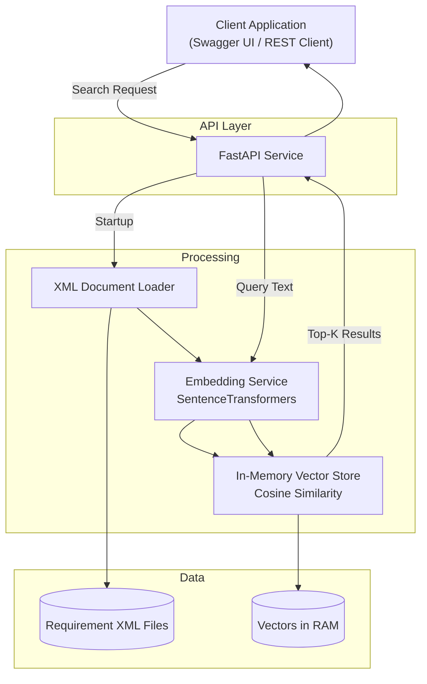

# AI Requirements Engine – Architecture

---

## 1. Overview

The AI Requirements Engine is a modular semantic retrieval service.

It loads structured requirement documents, converts them into vector embeddings, and performs similarity-based search via a REST API.

The system is designed as the retrieval component of a Retrieval-Augmented Generation (RAG) architecture.

---

## 2. System Architecture

## 3. Components

### API Layer

Provides REST endpoints for search and health checks.

Responsibilities:

- Accept search requests  
- Trigger embedding of query text  
- Return structured JSON responses  
- Perform startup initialization  

---

### Document Loader

Parses XML requirement files and extracts relevant text fields.

Responsibilities:

- Load `.xml` files from the data directory  
- Extract requirement ID and description  
- Prepare data for embedding generation  

---

### Embedding Service

Generates normalized vector embeddings using SentenceTransformers.

Responsibilities:

- Convert text into semantic vector representations  
- Normalize embeddings for cosine similarity search  

---

### Vector Store

Stores embeddings in memory and performs similarity search.

Responsibilities:

- Maintain ID-to-vector mapping  
- Compute cosine similarity  
- Return Top-K most similar results  

---

## 4. Runtime Flow

### Startup Phase

When the application starts:

1. XML files are loaded  
2. Text fields are extracted  
3. Embeddings are generated  
4. The in-memory vector index is built  

This preprocessing step ensures fast runtime queries.

---

### Query Phase

For each search request:

1. The query text is converted into an embedding  
2. Similarity scores are computed  
3. The Top-K most similar requirements are identified  
4. Results are returned via the API  

---

## 5. Design Approach

The system follows a simple modular structure:

- Clear separation between API, processing logic, and data  
- Startup-time preprocessing for runtime efficiency  
- In-memory retrieval for simplicity and performance  
- Designed to be extendable towards a full RAG pipeline  