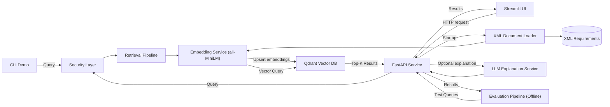

# AI Requirements Engine – Architecture

---

## 1. Overview

The AI Requirements Engine is a modular semantic retrieval system built around a persistent vector database.

It loads structured requirement documents, converts them into vector embeddings using SentenceTransformers (all-MiniLM-L6-v2), and stores them in a Qdrant vector database. Semantic similarity search is exposed via a FastAPI-based REST API.

The system supports incremental indexing, meaning only new or previously unseen requirements are embedded and stored.

All incoming queries are processed through a dedicated security layer that performs input sanitization and sensitive data detection before any downstream processing.

The system can be accessed through different clients, including a CLI demo, a Streamlit-based web interface, and standard REST clients such as Swagger UI.  
All clients communicate with the FastAPI service, which exposes the semantic retrieval functionality.

The system is designed as the retrieval component of a Retrieval-Augmented Generation (RAG) architecture.  
It can optionally generate explanations for retrieved requirements using an additional LLM service.

---

## 2. System Architecture



### CLI Demo Interface

In addition to the REST API, the system also provides a simple command-line demo (`demo.py`).

The CLI demo directly invokes the retrieval pipeline and allows users to test semantic search interactively without starting the API server.

Flow:
```
      User Input (CLI)
            ↓
      Security Layer
            ↓
      Retrieval Pipeline
            ↓
      Embedding Service
            ↓
      Vector Database Search (Qdrant)
            ↓
      Console Output (Top-K Matches)

```


## 3. Components

### API Layer

Provides REST endpoints for search and health checks.

Responsibilities:

- Accept search requests
- Trigger embedding of query text
- Return structured JSON responses
- Perform startup initialization
- Interface to the vector database for retrieval operations

---

### Document Loader

Parses XML requirement files and extracts relevant text fields.

Responsibilities:

- Load `.xml` files from the data directory  
- Extract requirement ID and description  
- Prepare data for embedding generation  

---

### Embedding Service

Generates dense vector embeddings for semantic similarity search  

Responsibilities:

- Convert text into semantic vector representations  
- Normalize embeddings for cosine similarity search  
- Uses the SentenceTransformers model `all-MiniLM-L6-v2` to generate dense vector embeddings optimized for semantic similarity tasks.

---

### Vector Database (Qdrant)

Stores embeddings in a persistent vector database and performs similarity search.

Responsibilities:

- Maintain vector representations of requirements  
- Store embeddings together with metadata (ID, text)  
- Perform cosine similarity search via vector queries  
- Persist embeddings across application restarts  
- Support incremental indexing by avoiding duplicate entries

---

### LLM Output Service

Generates explanations for retrieved requirements using a large language model.

Responsibilities:

- Format retrieved requirements for the prompt
- Generate short explanations for semantic similarity
- Produce a structured explanation output
- Call the OpenAI API to generate the response

---

### Streamlit Web Interface

In addition to the CLI demo and REST API access, the system also provides a lightweight web interface implemented with Streamlit (`src/ui/app.py`).

The Streamlit UI acts as a client for the FastAPI service and allows users to interactively submit requirement queries, configure the number of results, and inspect retrieved requirements together with their similarity scores.

The UI communicates with the API via HTTP requests to the `/analyze` endpoint.

---

### Evaluation Framework

Provides an offline evaluation pipeline for assessing retrieval quality and LLM-generated explanations.

Responsibilities:

- Execute predefined test queries
- Compare retrieved results against expected requirement IDs
- Compute retrieval metrics (precision, recall, hit rate)
- Evaluate LLM explanations for correctness and grounding
- Identify failure cases and low-confidence results

---

### Security Layer

Preprocesses all incoming queries before they are passed to embedding or LLM components.

Responsibilities:

- Detect sensitive data (API keys, emails, phone numbers)
- Mask non-critical data (e.g. emails, phone numbers)
- Block requests containing critical data (e.g. API keys)
- Ensure no sensitive data reaches vector storage or LLM services
- Provide sanitized query output for downstream processing
- Enforce request rejection at the API level for blocked queries

---

## 4. Runtime Flow

### Startup Phase

When the application starts:

1. XML files are loaded  
2. Text fields are extracted  
3. Existing requirement IDs are retrieved from the vector database  
4. Only new (previously unseen) requirements are embedded  
5. New embeddings are stored in Qdrant  

This incremental indexing strategy avoids redundant computation and improves startup performance.

---

### Query Phase

For each search request:

1. The query is processed by the security layer  
2. Sensitive data is masked or the request is blocked  
3. The sanitized query is converted into an embedding  
4. A vector similarity search is performed in Qdrant  
5. The Top-K most similar requirements are identified  
6. The retrieved results can optionally be passed to the LLM service to generate an explanation  
7. Results are returned via the API  

---

## 5. Design Approach

The system follows a simple modular structure:

- Persistent vector storage using Qdrant for scalability  
- Incremental indexing to avoid redundant embedding computation  
- Clear separation between data ingestion, embedding, and retrieval  
- API-first design enabling multiple clients (CLI, UI, REST)  
- Optional LLM layer for semantic explanation of results  
- Designed as a foundation for scalable RAG systems
- Centralized security layer for input validation and data protection  
- Stateless security layer applied consistently across all system entry points  
- Dedicated evaluation pipeline for measuring retrieval and LLM performance 
- Clear separation between online (runtime) and offline (evaluation) workflows
