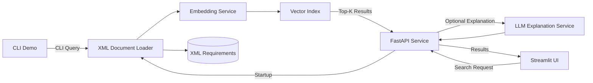

# AI Requirements Engine – Architecture

---

## 1. Overview

The AI Requirements Engine is a modular semantic retrieval service.

It loads structured requirement documents, converts them into vector embeddings and performs similarity-based search via a REST API.

The system can be accessed through different clients, including a CLI demo, a Streamlit-based web interface, and standard REST clients such as Swagger UI.  
All clients communicate with the FastAPI service, which exposes the semantic retrieval functionality.

The system is designed as the retrieval component of a Retrieval-Augmented Generation (RAG) architecture.  
It can optionally generate explanations for retrieved requirements using an additional LLM service.

---

## 2. System Architecture



### CLI Demo Interface

In addition to the REST API, the system also provides a simple command-line demo (`demo.py`).

The CLI demo directly invokes the retrieval pipeline and allows users to test semantic search interactively without starting the API server.

Flow:
```
    User Input (CLI)
          ↓
    Retrieval Pipeline
          ↓
    Embedding Service
          ↓
    Vector Store Search
          ↓
    Console Output (Top-K Matches)
```


## 3. Components

### API Layer

Provides REST endpoints for search and health checks.

Responsibilities:

- Accept search requests
- Trigger embedding of query text
- Return structured JSON responses
- Perform startup initialization

---

### Document Loader

Parses XML requirement files and extracts relevant text fields.

Responsibilities:

- Load `.xml` files from the data directory  
- Extract requirement ID and description  
- Prepare data for embedding generation  

---

### Embedding Service

Generates normalized vector embeddings using SentenceTransformers.

Responsibilities:

- Convert text into semantic vector representations  
- Normalize embeddings for cosine similarity search  

---

### Vector Store

Stores embeddings in memory and performs similarity search.

Responsibilities:

- Maintain ID-to-vector mapping  
- Compute cosine similarity  
- Return Top-K most similar results  

---

### LLM Output Service

Generates explanations for retrieved requirements using a large language model.

Responsibilities:

- Format retrieved requirements for the prompt
- Generate short explanations for semantic similarity
- Produce a structured explanation output
- Call the OpenAI API to generate the response

---

### Streamlit Web Interface

In addition to the CLI demo and REST API access, the system also provides a lightweight web interface implemented with Streamlit (`src/ui/app.py`).

The Streamlit UI acts as a client for the FastAPI service and allows users to interactively submit requirement queries, configure the number of results, and inspect retrieved requirements together with their similarity scores.

The UI communicates with the API via HTTP requests to the `/analyze` endpoint.

---

## 4. Runtime Flow

### Startup Phase

When the application starts:

1. XML files are loaded  
2. Text fields are extracted  
3. Embeddings are generated  
4. The in-memory vector index is built  

This preprocessing step ensures fast runtime queries.

---

### Query Phase

For each search request:

1. The query text is converted into an embedding  
2. Similarity scores are computed  
3. The Top-K most similar requirements are identified  
4. The retrieved results can optionally be passed to the LLM service to generate an explanation  
5. Results are returned via the API  

---

## 5. Design Approach

The system follows a simple modular structure:

- Clear separation between API, processing logic, and data  
- Startup-time preprocessing for runtime efficiency  
- In-memory retrieval for simplicity and performance
- Optional LLM explanation layer for semantic interpretation of retrieved results
- Designed to be extendable towards a full RAG pipeline
