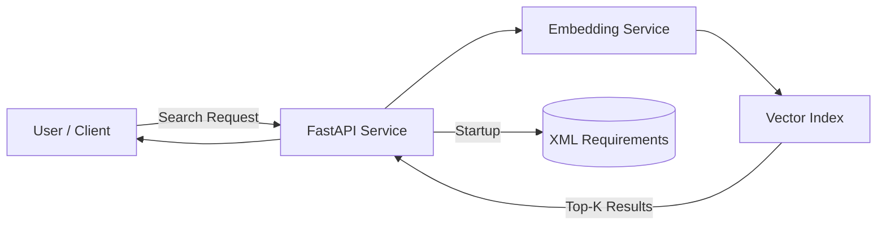

# AI Requirements Engine

A prototype AI system for semantic requirement retrieval using embedding-based similarity search.
The system indexes structured XML requirements and exposes semantic search via a REST API and CLI demo.

Author: Patrick Nanz

## Quickstart

Run the interactive demo:

```bash 
python demo.py
```

## 1. Project Goal

This project implements the core retrieval component of a Retrieval-Augmented Generation (RAG) architecture.  
It enables semantic comparison of customer requirements to identify previously implemented similar requirements.


## 2. Architecture Overview

Requirements are stored as individual XML files (simulating ALM/PLM systems like Polarion or Doors), containing structured metadata (title, status, owner, description).
→ Document Loader  
→ SentenceTransformer Embeddings  
→ In-Memory Vector Store  
→ Cosine Similarity Search  



For a detailed architecture overview see /docs/architecture.md


## 3. Tech Stack

- Python
- FastAPI
- SentenceTransformers
- NumPy
- Uvicorn
- Pydantic
- In-memory vector similarity search
- REST API


## 4. How to Run

### Run with Docker

Build the container:
```bash
docker build -t ai-requirements-engine .
```

Run the API:
```bash 
docker run -p 8000:8000 ai-requirements-engine
```

The API will be available at:
http://localhost:8000/docs

### Run CLI Demo

You can run an interactive demo of the retrieval engine:

```bash 
python demo.py
```

The demo will:

1. Load all XML requirements from data/raw/
2. Generate embeddings for the requirements
3. Build an in-memory vector index
4. Allow interactive similarity search via the command line


## 5. Core Components

- embedding/ → Embedding service using SentenceTransformers
- retrieval/ → Custom in-memory vector store
- pipeline/ → Retrieval orchestration logic


## 6. API Layer

The retrieval engine is exposed via a REST API using FastAPI.

### Startup Behavior

On application startup:

- All XML requirements are loaded
- Text content is extracted
- Embeddings are generated once
- An in-memory vector index is built
- Documents remain cached in RAM for fast retrieval

### Available Endpoints

#### Health Check

GET /health

Response:
```json
{
	"status": "ready"
}
```
#### Semantic Search

POST /search

Request Body:
```json
{
	"query": "customer requirement text",
	"top_k": 3
}
```
Response:
```json
[
	{
		"id": "REQ-1191",
		"similarity": 0.87,
		"text": "To ensure a long battery life..."
	}
]
```

### Run API

Start the API server:

uvicorn src.api.main:app --reload

Open Swagger UI:
http://localhost:8000/docs


## 7. Testing

The project includes automated tests using pytest.

Run tests with:

pytest

Test coverage includes:
- API health endpoint
- embedding service behavior
- API request handling


## 8. Project Structure

```
ai-requirements-engine/
│
├── demo.py               CLI demo for semantic requirement search
├── README.md
├── pyproject.toml
│
├── data/
│   └── raw/              XML requirement documents
│
├── docs/
│   └── architecture.md
│
└── src/
	├── api/              FastAPI service layer
	├── embedding/        Embedding generation (SentenceTransformers)
	├── retrieval/        Vector store and similarity search
	├── pipeline/         Document loading and retrieval pipeline
	└── tests/            Automated tests
```


## 9. Next Steps

- Docker Compose orchestration
- Vector database integration
- Extension to full RAG architecture